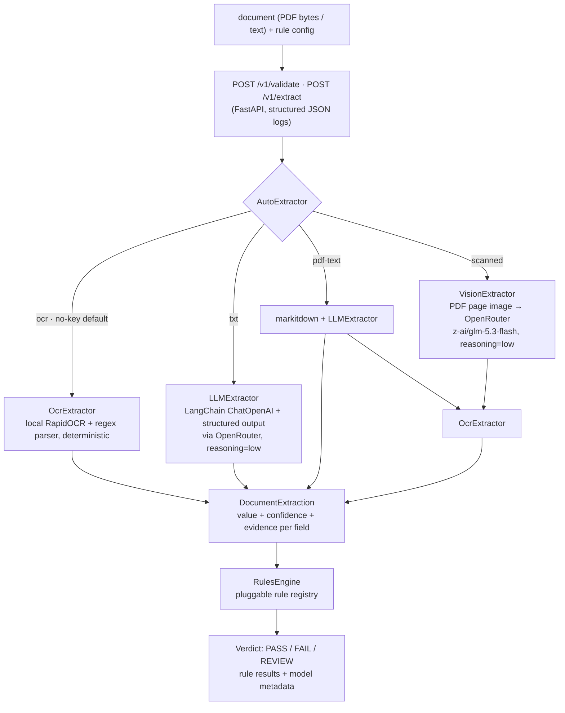

# docvalidator — AI document validator (production-shaped slice)

Structured field extraction + configurable business-rule verdicts for `SUPPLIER_INVOICE`
documents, exposed as a thin FastAPI service, with a document-type auto router over LLM/VLM/OCR
extraction paths and a measurable evaluation harness.

> Status: work in progress (24h technical assessment). This README is completed in the final phase.

## Quickstart (60 seconds)

```bash
uv sync
uv run uvicorn docvalidator.api.main:app --reload --port 8000
# health check
curl -s localhost:8000/health
```

The service runs with **zero configuration**: without an `OPENROUTER_API_KEY` the default
extraction backend is the credential-free OCR floor (local RapidOCR — its ONNX weights ship in
the Docker image, so there is no network call and no paid credential at runtime); with a key
present, the LangChain Auto routing becomes the primary engine. An examiner-only API key (budget-capped at **$1 USD**, expiring **one week** after
the submission date) is delivered out-of-band with the submission — paste it into `.env`
(see `.env.example`) to run the LLM path; the repo itself never contains any key.

### Backend selection contract

| Condition | Default backend |
|---|---|
| `OPENROUTER_API_KEY` present | `auto` (routes text/PDF text → LLM and scanned PDFs → VLM, with OCR fallback) |
| No key (or key expired) | `ocr` (local RapidOCR + deterministic regex parsing, ~1 s/doc, $0) |

- Four extraction backends: `extraction_backend: "auto" | "llm" | "vlm" | "ocr"`.
- **No API-level runtime fallback:** extraction failures surface through their typed HTTP error
  mapping; the API does not silently retry with another backend.

## Golden dataset v2

The fixed evaluation set is generated, not hand-maintained. It contains 60
documents: 40 text cases and 20 single-page PDF cases, split evenly between
English and Spanish. Tier 0 is canonical, tier 1 adds label and format variants,
and tier 2 stresses rare labels, mixed formats, and unlabeled/mixed currency.
Every case carries generated field truth and verdict truth.

| Lane | Tier | Count | Scenarios |
|---|---:|---:|---|
| TXT | 0 | 12 | clean, stale |
| TXT | 1 | 16 | clean, stale variants |
| TXT | 2 | 12 | missing total, mixed/unlabeled currency |
| PDF | 0 | 6 | clean, stale |
| PDF | 1 | 8 | clean, missing date |
| PDF | 2 | 6 | clean, mixed/unlabeled currency |

Regenerate or verify it with:

```bash
uv run python -m fixtures.generator.build
uv run python -m fixtures.generator.build --verify
```

The build writes `manifest_txt.json` and `manifest_pdf.json` fragments plus the
merged `manifest.json`; `--verify` re-derives both lanes and checks hashes and
orphan files. There is no tier 3 lane: rule scenarios are distributed in tiers
0–2 and remain represented by their expected verdicts.

### Gates policy

`eval.run` prints a `GATES` section by default:

- `tier:0` is hard for each lane: field accuracy and verdict agreement >= `0.95`.
- `tier:1` is hard for each lane: field accuracy >= `0.60` and verdict agreement >= `0.25`.
- `tier:2` and scenario slices are informative.
- Lane and global lane aggregates are informative; `--no-gates` preserves the
  legacy optional `--min-field-accuracy` and `--min-verdict-agreement` behavior.

### Extractor baseline (credential-free OCR floor)

Measured 2026-09-03 with `uv run python -m eval.run --as-of 2026-09-03` (the OCR floor is now the
default lane, so scanned PDFs are read by local RapidOCR instead of being a counted miss):

| Slice (lane `ocr`, per tier across txt+pdf+scanned) | Field accuracy | Verdict agreement |
|---|---:|---:|
| Tier 0 (aggregate) | 94.00% | 84.00% |
| TXT tier 1 | 69.54% | 37.93% |
| TXT tier 2 | 49.31% | 37.50% |

Latency per document (measured): text ~0.2 ms (no OCR engine involved), digital-born PDF
**543–942 ms**, scanned PDF **516–811 ms** — $0/doc.
The pre-OCR regex floor measured identical txt/pdf accuracy at ~0.2 ms/doc but returned zero
fields for every scanned PDF (the documented gap this floor closes).

## Evaluation harness

```bash
uv run python -m eval.run --as-of 2026-09-03   # credential-free lanes + GATES section
# hard gates by tier: tier0 >= 0.95/0.95, tier1 >= 0.60/0.25; tier2 and scenario slices informative
uv run python -m eval.run --no-gates           # report only
uv run python -m eval.run --lane ocr --as-of 2026-09-03
uv run python -m eval.run --lane all --live --as-of 2026-09-03
uv run python -m eval.run --lane all --live --as-of 2026-09-03 --json-out eval/report.json
```

The credential-free OCR floor runs over the v2.2 golden set (43 txt + 23 digital-born
single-page pdf + 12 image-only scanned pdf fixtures across
tiers 0-2: label/format variants, unlabeled currency, distractor totals, textured
PDF layouts): text documents and digital-born PDFs go through the same deterministic
regex parser, while scanned PDFs are rasterized and run through local RapidOCR — so
the comparison is reproducible without credentials and the scanned lane is no longer
a blind spot. Runs are anchored to
`--as-of` (default 2026-09-03) so age-rule expectations never rot with
wall-clock time. Known extractor misses at tier 1-2 (see the measured table
above): spelled-out dates, GB-format VAT ids, and rare label variants — the
dataset isolates them; closing the gap is the LLM backend's job.

The v2.2 dataset also contains 12 deterministic image-only scanned PDFs
(4 per tier, 2 per language) with the same truth as their PDF twins. The regex-only
floor deliberately cannot read them; `--include-scanned` (default on) reports
them as a separate `scanned` lane for VLM/OCR measurements and does not
contribute to the txt/pdf gates. Use `--no-include-scanned` to omit the section.

### Multi-lane decision table

`--lane` accepts comma-separated engine lanes: `ocr`, `slm`, `vlm`,
`auto`, or `all`. The default is the credential-free set (`ocr` — its ONNX
weights ship in the Docker image, no key needed). `--live` is required for
`slm`, `vlm`, and `auto`; they are skipped with an explicit message when OpenRouter
credentials are absent, never crashing the run.

Eligibility: `ocr` runs the full matrix (txt + pdf + scanned; text bypasses the OCR engine),
`slm` runs txt + pdf via markitdown text, both `vlm` and `ocr` cover scanned + pdf,
and `auto` runs the full matrix (txt + pdf + scanned) through the document-type
router — its metadata sub-route (`llm` / `vlm` / `ocr`) is what the table slices
into the `auto:llm`, `auto:vlm`, and `auto:ocr` rows, so the per-route cost and
latency of the router's decisions are visible next to the forced lanes.

The decision table reports one row per lane x format x tier with field
accuracy, verdict agreement, mean confidence on exact-match cells (`conf-ok`)
vs mismatched cells (`conf-bad`), average measured milliseconds, average provider
total tokens for LLM lanes, and an estimated per-document cost for
`z-ai/glm-5.3-flash` (USD $0.000000075/prompt token + $0.00000025/completion
token; blended against recorded total tokens). Local lanes are $0. The two
confidence columns are the honesty check on the confidence system: when they
converge, confidence does not separate right from wrong and must not gate
automation. Extraction
and API failures count as field/verdict misses. `--json-out eval/report.json`
writes the full report plus its `decision_table` array.

## API

| Method | Path | Purpose |
|---|---|---|
| POST | `/v1/validate` | document + config → extraction + rule verdict |
| POST | `/v1/extract` | document → extraction only |
| GET  | `/health` | liveness |

### API contract

`POST /v1/validate` accepts **either** representation:

- **Multipart form** (`multipart/form-data`): `file` (a `.pdf` — read through its text layer —
  or a `.txt`) + `config` (a JSON string matching the config example above).
- **JSON body** (`application/json`), exactly one content source:
  - `text` — plain-text document content, **or**
  - `content_b64` — base64-encoded document bytes (PDF by default; decoded as text when
    `filename` ends in `.txt`) — plus optional `filename`;
  - optional `config` (defaults apply when omitted);
  - optional `extraction_backend`: `auto` | `llm` | `vlm` | `ocr` (default: `auto` with a key, else `ocr`).

Responses: `200` with the verdict (see the sample below), `422` with a structured
`{"error": {"code", "message", "details"}, "request_id"}` body for invalid input or
unreadable documents, `5xx` only for upstream LLM failures. Every response echoes an
`X-Request-ID` header (client-supplied or generated) that also appears in the structured logs.

`POST /v1/extract` accepts the same representations and returns only the extraction object.

## Architecture



Key decisions (full rationale below in Trade-offs):

1. **Auto router, keyed primary, OCR floor.** With a key present the LangChain router is the
   default engine; the local OCR extractor stays as the credential-free default, so the
   assessment's offline-first requirement is preserved: every lane (API, tests, eval, CI) still runs
   with zero credentials — the OCR engine is fully local (ONNX weights in the image).
2. **REVIEW vs FAIL distinction.** Missing required data ⇒ `REVIEW` (cannot judge); a violated
   rule with data present ⇒ `FAIL` (judged and rejected). Compliance verdicts need this nuance.
3. **Confidence is evidence-strength, not model probability.** Documented per-field: labeled
   pattern > structural pattern > heuristic.

### LLM extraction system prompt

The regex heuristics were specified in [`docs/prompts/`](docs/prompts/) (the executor briefs).
The LLM backend's system prompt — the single source of truth lives in
`src/docvalidator/extraction/llm.py` — is:

```text
You extract supplier invoice fields into the requested structured schema. Return the six
fields "supplier_name", "invoice_number", "invoice_date", "total_amount", "currency", and
"tax_id". Use null for absent fields, ISO dates (YYYY-MM-DD), float amounts, and ISO-4217
currency codes.
```

`LLMExtractor` builds a LangChain `ChatOpenAI` client against the configured OpenRouter base
URL and binds a Pydantic `InvoiceExtraction` schema with `with_structured_output`. The adapter
tries JSON-schema mode first, falls back to JSON mode if the provider rejects structured
output, and finally uses defensive JSON parsing of the raw completion. Invalid or incomplete
responses still raise `LLMParsingError`; timeouts, provider errors, and configuration failures
retain the existing API mappings.

### VisionExtractor (F1)

`VisionExtractor` is an explicit `extraction_backend: "vlm"` lane for image-only scanned
invoices. It rasterizes every PDF page to PNG at about 150 DPI using the pure-wheel
`pypdfium2` renderer, then sends the **first page image** (plus the same six-field structured
schema) through LangChain to OpenRouter. Multi-page scanning beyond page 1 is deferred; no
automatic text-to-VLM switching is added in this phase.

| Setting | Default |
|---|---|
| `VALIDATOR_VLM_MODEL` | `z-ai/glm-5.3-flash` |
| `VALIDATOR_VLM_REASONING_EFFORT` | `low` |
| `VALIDATOR_VLM_TIMEOUT_SECONDS` | `60` |

The same API key is reused. OpenRouter lists this model's input modalities as
`["text", "image", "video"]` and its prompt price at `$0.000000075/token`; expect image calls to
be slower than the text LLM lane and budget for image-token overhead. The 12 scanned
`fixtures/golden/scan_*.pdf` cases are the intended measurement surface (eval integration is
phase F3).

## Verdict contract

`PASS` — all rules evaluated and passed · `FAIL` — at least one rule failed with data present ·
`REVIEW` — required data missing, or a `severity="review"` rule flagged a quality concern;
a human should look at the document.

Every response also carries `verdict_confidence` (`0.0`–`1.0`), the engine's confidence in a
`PASS`: the **minimum evidence strength** among the fields that decided the verdict (all
`required_fields` when passing; only the failed/inconclusive rules' `deciding_fields`
otherwise). `FAIL` and `REVIEW` are pinned to `0.0` — they carry their rule evidence in
`rule_results` instead of a decision confidence. Confidence itself is **evidence strength,
not a model probability**: regex over an explicit label scores 0.95, structural patterns
0.8–0.9, and the LLM path scores 0.75 per parsed value (0.6 for a reported-absent field) —
the LLM is a black-box call, so its confidence reflects observable evidence, not self-reported
certainty.

<!-- Sample request/response: filled in the final phase -->

### Sample request/response

```bash
curl -s -X POST localhost:8000/v1/validate \
  -H 'Content-Type: application/json' \
  -d '{
    "text": "ACME Supply GmbH\nInvoice No: INV-2026-041\nInvoice Date: 2026-09-01\nTotal: 1250.00\nCurrency: EUR\nVAT: DE123456789",
    "config": {
      "max_age_days": 90,
      "allowed_currencies": ["EUR", "GBP"],
      "required_fields": ["supplier_name", "invoice_number", "invoice_date", "total_amount"]
    }
  }'
```

```json
{
  "status": "PASS",
  "verdict_confidence": 0.8,
  "rule_results": [
    {"rule_id": "invoice_date_present_and_fresh", "passed": true, "message": "invoice date is present and fresh", "inconclusive": false, "severity": "reject", "deciding_fields": []},
    {"rule_id": "total_amount_present_and_positive", "passed": true, "message": "total amount is present and positive", "inconclusive": false, "severity": "reject", "deciding_fields": []},
    {"rule_id": "supplier_name_present", "passed": true, "message": "supplier name is present", "inconclusive": false, "severity": "reject", "deciding_fields": []},
    {"rule_id": "currency_allowed", "passed": true, "message": "currency is allowed", "inconclusive": false, "severity": "reject", "deciding_fields": []},
    {"rule_id": "low_confidence_fields_review_0_5", "passed": true, "message": "all extracted fields have confidence >= 0.5", "inconclusive": false, "severity": "reject", "deciding_fields": []}
  ],
  "extraction": {
    "document_type": "SUPPLIER_INVOICE",
    "fields": {
      "supplier_name":  {"value": "ACME Supply GmbH", "confidence": 0.8,  "evidence": "ACME Supply GmbH",   "page_hint": null},
      "invoice_number": {"value": "INV-2026-041",     "confidence": 0.95, "evidence": "Invoice No: INV-2026-041", "page_hint": null},
      "invoice_date":   {"value": "2026-09-01",       "confidence": 0.95, "evidence": "2026-09-01",       "page_hint": null},
      "total_amount":   {"value": 1250.0,             "confidence": 0.95, "evidence": "Total: 1250.00",   "page_hint": null},
      "currency":       {"value": "EUR",              "confidence": 0.95, "evidence": "Currency: EUR",    "page_hint": null},
      "tax_id":         {"value": "DE123456789",      "confidence": 0.95, "evidence": "VAT: DE123456789", "page_hint": null}
    },
    "metadata": {"backend": "ocr", "duration_ms": 1.711, "model": "pp-ocrv5-onnx", "provider": "rapidocr-local", "total_tokens": null}
  },
  "request_id": "a5cb8bb2-8f10-4b02-aa77-be3b8e07d49e"
}
```

Errors are structured too: `{"error": {"code": "...", "message": "...", "details": [...]}, "request_id": "..."}`.


## Trade-offs consciously made

1. **Auto router, keyed primary, OCR floor.** With a key present the auto router is the default
   backend: text → LLM, selectable-text PDF → markitdown+LLM, scanned PDF → VLM, each with the local
   OCR engine as a structural second echelon (never as a silent format-level retry). Without a key the
   credential-free OCR floor is the default. Extraction failures surface as typed HTTP errors
   (503 configuration / 502 provider or parsing / 504 timeout) — there is no API-level runtime fallback
   that silently degrades results. Tests and eval stay 100% credential-free, and latency is honest:
   ~2–5 s/document on the LLM/VLM paths vs ~1 s on the local OCR floor (the pre-OCR regex floor ran
   at ~3.5 ms but could not read scanned PDFs at all) — the client pays the latency only when a
   key is configured.
2. **REVIEW ≠ FAIL.** A rule whose input data is missing is marked `inconclusive` and cannot push the
   verdict to `FAIL`; missing required fields surface as `REVIEW`. Rationale: in compliance workflows,
   "judged and rejected" (FAIL) and "cannot judge, human needed" (REVIEW) have very different operational
   consequences — FAIL may block a supplier, REVIEW queues work. Conflating them would misroute documents.
3. **Confidence = evidence strength, not model probability.** Regex-parser confidences encode pattern
   quality (labeled 0.95 / structural 0.7–0.9 / heuristic <0.5); the LLM path reports 0.75 per parsed
   value (0.6 for a reported-absent field) because model-reported confidence is not calibrated. We
   prefer honest evidence tiers to a fake decimal.
4. **Fixtures instead of real cloud OCR.** The scope note says production OCR is out of scope; PDFs
   are supported through the text layer (markitdown) plus local RapidOCR for scanned pages, and
   plain-text fixtures drive the golden set. Scanned-image PDFs that yield no OCR text fail loudly
   with a typed error instead of silently returning empty extractions.
5. **One document type, extensible seams.** Only `SUPPLIER_INVOICE` is implemented, but the extractor
   interface, rule registry, and config schema are document-type aware; adding `CERTIFICATE` means a new
   extractor + rules, not a rewrite.

## Cost, latency, and risk notes

### OcrExtractor (F2)

`OcrExtractor` is the local OCR path and the credential-free floor. It rasterizes pages with
`pypdfium2` at `VALIDATOR_OCR_DPI` (default **200**), runs **RapidOCR**
(PP-OCRv5 detection + recognition models, ONNX Runtime, ~15MB wheel, no torch) locally
on CPU, joins page text in reading order, and parses the resulting plain text with the
deterministic regex parser (`extraction/parsing.py`). Plain-text requests skip rasterization/OCR
but retain `metadata.backend="ocr"`. Model/provider metadata are `pp-ocrv5-onnx` and
`rapidocr-local`; OCR failures and unreadable renders raise the typed extraction errors.

**Engine selection, measured.** We first implemented PaddleOCR-VL-1.6
(`PaddlePaddle/PaddleOCR-VL-1.6`, the OmniDocBench-lineage 0.9B document-parse VLM) via
transformers on CPU and rejected it after a live measurement: **~30+ s per single-page
scanned invoice on a 24-core host** (VLM autoregressive generation dominates), plus a
~2GB torch-based image. The niche for the local engine is credential-free,
network-free extraction — for that, seconds matter more than SOTA parsing: RapidOCR
delivers PP-OCRv5-grade line OCR at ONNX-CPU speed with a tiny dependency footprint,
and the downstream regex extractor handles the field mapping. The rejected alternative
is documented here deliberately — the decision is latency-measured, not guessed. For
highest-quality scanned extraction the VLM lane (OpenRouter, ~2s, 6/6 fields measured)
remains the primary path.

The default dependency group stays credential-free and testable without the model. The
OCR stack (pypdfium2, Pillow, `rapidocr-onnxruntime`, numpy) is a **main dependency** — it is
the credential-free floor — and Docker pre-downloads the ONNX weights during the image build, so
`docker compose up` has no network or API-key dependency at runtime.

Test the real engine explicitly (the default suite remains network-free and model-free):

```bash
RUN_REAL_OCR=1 uv run pytest -m slow -q
```

**When would you *not* use an LLM here?**

- Digital-born PDFs with stable labeled layouts (typical B2B invoice PDFs): regex/structural extraction
  is deterministic, free, ~ms-fast, and unit-testable — an LLM adds cost, latency, nondeterminism, and a
  failure mode without a quality win.
- Any verdict path that must be explainable in an audit: regex evidence (the exact matched text) is
  stronger evidence than an LLM's answer.
- Very high volume of low-value documents where a wrong extraction just routes to review anyway.

The LLM earns its keep on messy scanned documents, highly varied layouts, and multi-language
suppliers — that's why it ships as an opt-in adapter with a recorded stub for offline testing.

**What did we measure?**

- OCR floor path (measured, from the structured request logs): **~0.2 ms** per text document,
  **~0.5–1.0 s** per PDF (render + local RapidOCR), zero marginal cost, zero credentials.
- LLM path (measured live, model `z-ai/glm-5.3-flash` via OpenRouter, single invoice): **~7.5 s,
  ~300 total tokens** per document → well under a cent per document on an open-weight model.
  Per-document latency and token usage are returned in `extraction.metadata` (`duration_ms`,
  `model`, `provider`, `total_tokens`) and logged per request.
- Eval harness: credential-free OCR floor over the v2.2 golden set (78 fixtures: 43 txt + 23 digital
  PDF + 12 scanned) — **94% field accuracy / 84% verdict agreement on tier 0** (scanned PDFs now
  read locally instead of being a counted miss), with per-tier hard gates that fail CI on
  regression; slice results are reported per format and tier.

**What would we monitor in production?**

- **Quality drift:** scheduled re-run of the golden set + a sample of live documents against updated
  expectations; alert on field accuracy or verdict agreement dropping below threshold.
- **Confidence distribution:** a shift toward low-confidence extractions signals layout drift before
  customers complain.
- **Verdict mix:** sudden changes in PASS/FAIL/REVIEW ratios usually mean upstream document format
  changes (or extractor regressions).
- **Cost & latency (LLM backend):** tokens and ms per document per day, provider error/timeout rates,
  spend cap alerts.
- **Operational:** request error rate by code (422 vs 5xx), PDF text-layer failures (they indicate
  scanned documents needing real OCR).

## What I would do next with another day

Done since the first submission: golden set grown 6 → 78 fixtures (43 txt + 23 digital PDF +
12 scanned image-only PDFs; subtotal traps, credit notes, US/JP formats, empty/garbage
documents, degenerate failure modes), scanned fixture lane, and the eval wired into CI as
a tiered regression gate.

PDF parsing now uses Microsoft `markitdown` instead of raw `pypdf`. Markitdown gives a
higher-level, converter-based PDF-to-Markdown path and keeps PDF handling out of hand-written
page-extraction code; the trade-off is a larger dependency footprint and less direct control over
page-level parsing than pypdf. For this project, the typed empty-text and unreadable-PDF failures
are unchanged, and the simpler adapter wins.

1. **VisionExtractor hardening**: reuse the same `Extractor` interface while extending the
   first-page implementation to multi-page policies, confidence calibration, and automatic
   scanned-document cascade decisions.
2. Locale-metadata-aware date disambiguation (the known `us_date_ambiguous` miss) instead of
   always reading `03/07/2026` day-first.
3. Real OCR adapter (Azure Document Intelligence) behind the same `Extractor` interface for scanned PDFs.
4. Page-level evidence spans and a debug endpoint returning per-field extractor traces.
5. Second document type (`CERTIFICATE_OF_INCORPORATION`) to pressure-test the extensibility claim.
6. Optional live LLM lane in the eval harness (real API, gated behind a key) next to the recorded one.
