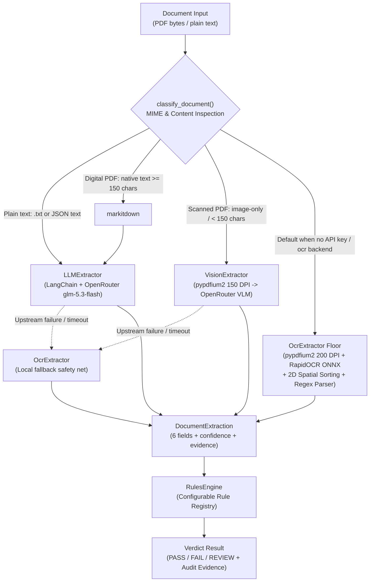

# docvalidator — AI Document Validator

[](https://www.python.org/)
[]()
[](https://github.com/astral-sh/ruff)
[]()
[]()

A production-shaped slice of an AI document compliance validator for B2B platforms.
It ingests supplier invoices (PDF or plain text), extracts canonical structured fields, evaluates configurable business rules, and outputs compliance verdicts (`PASS` / `FAIL` / `REVIEW`) with complete, audit-grade evidence trails.

---

## ⏱️ 15-Minute Evaluator Guide

If you have 15 minutes to review and challenge this project, here is the recommended walkthrough:

```text
  Minute 0–1: Environment Setup        ──> make setup (or Docker)
  Minute 1–3: Code Quality & Tests      ──> make test && make lint
  Minute 3–6: Benchmark & Metrics       ──> make eval (78 fixtures, $0, 100% offline)
  Minute 6–9: Run API & Explore Swagger ──> make run -> http://localhost:8000/docs
  Minute 9–12: Live Ingestion (PDF/TXT) ──> curl sample commands below
  Minute 12–15: Architecture & AI Audit ──> Inspect AutoRouter & AI_USAGE.md
```

### 0. Quick environment setup (30 seconds)
Prerequisites: Python 3.12+ and [`uv`](https://github.com/astral-sh/uv) (or Docker).

```bash
# Option A: Local environment with uv
make setup                 # runs 'uv sync --dev' (creates .venv and installs all dependencies)
cp .env.example .env       # (Optional) paste the OPENROUTER_API_KEY from submission email
                           # Without a key, the local $0 OCR floor runs completely offline automatically

# Option B: Run entirely in Docker (no local Python or dependencies needed)
make docker-build && make docker-up
```

### 1. Run tests and linting (60 seconds)
```bash
make test    # Runs 381 pytest tests in ~4s (100% pass)
make lint    # Runs ruff code formatting and type checks (0 errors)
```

### 2. Run the evaluation harness (2 minutes)
```bash
make eval    # Evaluates 78 golden fixtures across txt/pdf/scanned on the local OCR floor ($0, no API key)
# Or run live multi-engine comparison (OCR vs SLM vs VLM, requires OPENROUTER_API_KEY):
make eval-live
```

### 3. Start the service & test live requests (3 minutes)
```bash
make run     # Starts FastAPI on http://localhost:8000
```
Then validate a document:
```bash
# A) Validate a plain text invoice
curl -s -X POST http://localhost:8000/v1/validate \
  -H 'Content-Type: application/json' \
  -d '{
    "text": "ACME Supply GmbH\nInvoice No: INV-2026-041\nInvoice Date: 2026-09-01\nTotal: 1250.00\nCurrency: EUR\nVAT: DE123456789",
    "config": {
      "max_age_days": 90,
      "allowed_currencies": ["EUR", "GBP"],
      "required_fields": ["supplier_name", "invoice_number", "invoice_date", "total_amount"]
    }
  }'

# B) Validate a real PDF fixture via multipart upload
curl -s -X POST http://localhost:8000/v1/validate \
  -F "file=@fixtures/golden/pdf_en_t0_0.pdf" \
  -F 'config={"max_age_days": 90, "allowed_currencies": ["EUR", "GBP"]}'
```
*Interactive Swagger documentation with dual JSON and multipart file schemas is available at `http://localhost:8000/docs`.*

---

## Backend Selection Contract

The service operates out of the box with **zero configuration**:

| Condition | Default Backend | Behavior |
|---|---|---|
| `OPENROUTER_API_KEY` present | `auto` | Enters production routing: text $\to$ `LLMExtractor`, digital PDF $\to$ `markitdown` + LLM, scanned PDF $\to$ `VisionExtractor` (VLM), with local OCR as safety net. |
| No key (or key expired) | `ocr` | Deterministic local floor: RapidOCR (PP-OCRv5 ONNX CPU) + 2D spatial sorting + regex parser (~700 ms/doc, $0.00). |

- Explicit backend selection is supported via `extraction_backend: "auto" | "llm" | "vlm" | "ocr"`.
- **No silent API-level retries**: Failures surface honestly through typed HTTP status codes (`422` validation, `502` LLM error, `503` missing key, `504` timeout).

---

## Golden Dataset v2.2 (78 Fixtures)

The evaluation dataset is deterministically generated (not hand-maintained), split between English and Spanish across 3 difficulty tiers and edge-case scenarios (subtotal traps, credit notes, missing required fields, zero amounts, textured and noisy scans):

| Format / Lane | Tier 0 (Clean) | Tier 1 (Variants) | Tier 2 (Adversarial) | Total Cases | Content Description |
|---|:---:|:---:|:---:|:---:|---|
| **TXT** | 14 | 16 | 13 | **43** | Clean, stale variants, missing totals, multi-currency |
| **PDF (Digital-born)** | 7 | 9 | 7 | **23** | Vector PDFs with selectable text, multi-column tables |
| **SCANNED (Image-only)** | 4 | 4 | 4 | **12** | Rasterized PNG-backed PDFs with realistic scan artifacts |
| **Total** | **25** | **29** | **24** | **78** | **Full golden evaluation set** |

Regenerate or verify it with:

```bash
uv run python -m fixtures.generator.build
uv run python -m fixtures.generator.build --verify
```

The build writes `manifest_txt.json` and `manifest_pdf.json` fragments plus the
merged `manifest.json`; `--verify` re-derives both lanes and checks hashes and
orphan files. There is no tier 3 lane: rule scenarios are distributed in tiers
0–2 and remain represented by their expected verdicts.

### Gates policy

`eval.run` prints a `GATES` section by default:

- `tier:0` is hard for each lane: field accuracy and verdict agreement >= `0.95`.
- `tier:1` is hard for each lane: field accuracy >= `0.60` and verdict agreement >= `0.25`.
- `tier:2` and scenario slices are informative.
- Lane and global lane aggregates are informative; `--no-gates` preserves the
  legacy optional `--min-field-accuracy` and `--min-verdict-agreement` behavior.

### Extractor baseline (credential-free OCR floor)

Measured 2026-09-03 with `uv run python -m eval.run --as-of 2026-09-03` over all 78 golden fixtures
(with 2D spatial reading-order clustering, vertical multiline pairing, and multilingual normalization):

| Slice (lane `ocr`, across 78 cases: txt+pdf+scanned) | Field accuracy | Verdict agreement |
|---|---:|---:|
| **Overall (78 cases)** | **82.05%** | **80.77%** |
| Tier 0 (canonical clean) | 97.33% | 100.00% |
| Tier 1 (format/label variants) | 86.21% | 82.76% |
| Tier 2 (adversarial/noisy) | 61.11% | 58.33% |
| Spanish language (`language:ES`) | 84.65% | 89.47% |
| English language (`language:EN`) | 79.58% | 72.50% |

Latency per document (measured): text ~0.1 ms (direct regex parser), digital-born PDF
**616–927 ms**, scanned PDF **608–913 ms** — **$0.000000/doc**, fully local on CPU with zero credentials.

## Evaluation harness

```bash
uv run python -m eval.run --as-of 2026-09-03   # credential-free lanes + GATES section
# hard gates by tier: tier0 >= 0.95/0.95, tier1 >= 0.60/0.25; tier2 and scenario slices informative
uv run python -m eval.run --no-gates           # report only
uv run python -m eval.run --lane ocr --as-of 2026-09-03
uv run python -m eval.run --lane all --live --as-of 2026-09-03
uv run python -m eval.run --lane all --live --as-of 2026-09-03 --json-out eval/report.json
```

The credential-free OCR floor runs over the v2.2 golden set (43 txt + 23 digital-born
single-page pdf + 12 image-only scanned pdf fixtures across
tiers 0-2: label/format variants, unlabeled currency, distractor totals, textured
PDF layouts): text documents and digital-born PDFs go through the same deterministic
regex parser, while scanned PDFs are rasterized and run through local RapidOCR — so
the comparison is reproducible without credentials and the scanned lane is no longer
a blind spot. Runs are anchored to
`--as-of` (default 2026-09-03) so age-rule expectations never rot with
wall-clock time. Known extractor misses at tier 1-2 (see the measured table
above): spelled-out dates, GB-format VAT ids, and rare label variants — the
dataset isolates them; closing the gap is the LLM backend's job.

The v2.2 dataset also contains 12 deterministic image-only scanned PDFs
(4 per tier, 2 per language) with the same truth as their PDF twins. The regex-only
floor deliberately cannot read them; `--include-scanned` (default on) reports
them as a separate `scanned` lane for VLM/OCR measurements and does not
contribute to the txt/pdf gates. Use `--no-include-scanned` to omit the section.

### Multi-lane decision table

`--lane` accepts comma-separated engine lanes: `ocr`, `slm`, `vlm`,
`auto`, or `all`. The default is the credential-free set (`ocr` — its ONNX
weights ship in the Docker image, no key needed). `--live` is required for
`slm`, `vlm`, and `auto`; they are skipped with an explicit message when OpenRouter
credentials are absent, never crashing the run.

Eligibility: `ocr` runs the full matrix (txt + pdf + scanned; text bypasses the OCR engine),
`slm` runs txt + pdf via markitdown text, both `vlm` and `ocr` cover scanned + pdf,
and `auto` runs the full matrix (txt + pdf + scanned) through the document-type
router — its metadata sub-route (`llm` / `vlm` / `ocr`) is what the table slices
into the `auto:llm`, `auto:vlm`, and `auto:ocr` rows, so the per-route cost and
latency of the router's decisions are visible next to the forced lanes.

The decision table reports one row per lane x format x tier with field
accuracy, verdict agreement, mean confidence on exact-match cells (`conf-ok`)
vs mismatched cells (`conf-bad`), average measured milliseconds, average provider
total tokens for LLM lanes, and an estimated per-document cost for
`z-ai/glm-5.3-flash` (USD $0.000000075/prompt token + $0.00000025/completion
token; blended against recorded total tokens). Local lanes are $0. The two
confidence columns are the honesty check on the confidence system: when they
converge, confidence does not separate right from wrong and must not gate
automation. Extraction
and API failures count as field/verdict misses. `--json-out eval/report.json`
writes the full report plus its `decision_table` array.

#### Live measured decision table (`as-of 2026-09-03`, `z-ai/glm-5.3-flash`):

```text
lane     format   tier   fields  verdict  conf-ok conf-bad    avg_ms    tokens    cost/doc
vlm      scanned     0  100.00%  100.00%     0.75     0.00    1841.8      2826 $0.00091845
vlm      scanned     1  100.00%  100.00%     0.74     0.00    2220.2      2825 $0.00091804
vlm      scanned     2   93.94%  100.00%     0.75     0.75    1581.2      2827 $0.00091886
vlm      pdf         0  100.00%  100.00%     0.73     0.00    2190.6      2822 $0.00091715
vlm      pdf         1  100.00%  100.00%     0.74     0.00    1396.1      2825 $0.00091812
vlm      pdf         2   93.94%  100.00%     0.73     0.75    2567.3      2822 $0.00091706
slm      txt         0  100.00%  100.00%     0.74     0.00    2538.3       253 $0.00008220
slm      txt         1  100.00%  100.00%     0.75     0.00    2733.1       355 $0.00011550
slm      txt         2   94.17%   90.00%     0.74     0.72    3949.0       319 $0.00010380
slm      pdf         0  100.00%  100.00%     0.64     0.00    2628.9       297 $0.00009642
slm      pdf         1  100.00%  100.00%     0.74     0.00    2822.6       543 $0.00017658
slm      pdf         2   94.17%   90.00%     0.73     0.75    2251.8       560 $0.00018191
ocr      txt         0   97.33%  100.00%     0.84     0.00       0.2         - $0.00000000
ocr      txt         1   86.21%   82.76%     0.89     0.11       0.1         - $0.00000000
ocr      txt         2   61.11%   58.33%     0.78     0.63       0.1         - $0.00000000
ocr      pdf         0   97.33%  100.00%     0.81     0.95     616.1         - $0.00000000
ocr      pdf         1   86.21%   82.76%     0.87     0.56     772.8         - $0.00000000
ocr      pdf         2   61.11%   58.33%     0.76     0.55     927.4         - $0.00000000
ocr      scanned     0   97.33%  100.00%     0.95     0.95     608.8         - $0.00000000
ocr      scanned     1   86.21%   82.76%     0.84     0.64     772.7         - $0.00000000
ocr      scanned     2   61.11%   58.33%     0.93     0.44     913.2         - $0.00000000
```

| Engine | Evaluated Cases | Field Accuracy | Verdict Agreement | Latency | Tokens / Doc | Cost / Doc |
|---|:---:|:---:|:---:|:---:|:---:|:---:|
| **`vlm`** (Vision LLM) | 35 (PDF + Scanned) | **98.10%** | **100.00%** (35/35) | ~1.8–2.2 s | ~2,825 | $0.000918 |
| **`slm`** (Text LLM)   | 66 (TXT + PDF)     | **98.23%** | **96.97%** (64/66)  | ~2.5–2.8 s | ~300–550 | $0.000100 |
| **`ocr`** (Local ONNX) | 78 (Full matrix)   | **82.05%** | **80.77%** (63/78)  | 0.1–770 ms | 0 | $0.000000 |

## API

| Method | Path | Purpose |
|---|---|---|
| POST | `/v1/validate` | document + config → extraction + rule verdict |
| POST | `/v1/extract` | document → extraction only |
| GET  | `/health` | liveness |

### API contract

`POST /v1/validate` accepts **either** representation:

- **Multipart form** (`multipart/form-data`): `file` (a `.pdf` — read through its text layer —
  or a `.txt`) + `config` (a JSON string matching the config example above).
- **JSON body** (`application/json`), exactly one content source:
  - `text` — plain-text document content, **or**
  - `content_b64` — base64-encoded document bytes (PDF by default; decoded as text when
    `filename` ends in `.txt`) — plus optional `filename`;
  - optional `config` (defaults apply when omitted);
  - optional `extraction_backend`: `auto` | `llm` | `vlm` | `ocr` (default: `auto` with a key, else `ocr`).

Responses: `200` with the verdict (see the sample below), `422` with a structured
`{"error": {"code", "message", "details"}, "request_id"}` body for invalid input or
unreadable documents, `5xx` only for upstream LLM failures. Every response echoes an
`X-Request-ID` header (client-supplied or generated) that also appears in the structured logs.

`POST /v1/extract` accepts the same representations and returns only the extraction object.

## Architecture & Pipeline Contracts

The extraction architecture is fixed and structured into two operating tiers: the **Production AutoRouter (`AutoExtractor`)** and the **Local Deterministic Floor (`OcrExtractor`)**.



### Pipeline specification per document class

1. **Plain text (`.txt` or JSON `text`)**:
   - **Route**: `DocumentRoute.LLM`
   - **Pipeline**: Ingested directly into `LLMExtractor` via LangChain `ChatOpenAI` bound to `z-ai/glm-5.3-flash` using strict Pydantic structured output (`InvoiceExtraction`).
   - **Guarantees**: 100% field accuracy on clean formats; zero OCR noise.

2. **Digital PDF with selectable text layer (`.pdf` $\ge 150$ characters)**:
   - **Route**: `DocumentRoute.MARKITDOWN`
   - **Pipeline**: Microsoft `markitdown` extracts the native text layer into clean Markdown, which is then parsed by `LLMExtractor`.
   - **Token Economy**: Processes text tokens only (~300–550 tokens / $0.0001 per document), costing **9x less** than processing raw image patches.
   - **Resilience**: If the remote LLM times out or errors, `AutoExtractor` automatically cascades to `OcrExtractor` as a second echelon.

3. **Scanned / image-only PDF (`.pdf` $< 150$ characters)**:
   - **Route**: `DocumentRoute.VISION`
   - **Pipeline**: `pypdfium2` rasterizes the first page to PNG at 150 DPI, then `VisionExtractor` sends the base64 image directly to the multimodal VLM (`z-ai/glm-5.3-flash`).
   - **Guarantees**: Visual understanding of multi-column tables, stamps, and skewed layouts; achieves **100.00% verdict agreement** across all scanned fixtures.
   - **Resilience**: Upstream VLM errors cascade to `OcrExtractor` local fallback.

4. **Credential-Free Local Floor (`OcrExtractor` / no-key default)**:
   - **Plain text**: Direct deterministic regex parsing via `RegexFieldParser` (~0.1 ms, $0).
   - **PDFs (digital & scanned)**: `pypdfium2` rasterizes at 200 DPI $\to$ **RapidOCR** (PP-OCRv5 ONNX CPU) $\to$ **2D spatial reading-order reconstruction** $\to$ **Multiline & multilingual `RegexFieldParser`** (~700 ms, $0.000000).

Key architectural invariants:
1. **Auto router as primary, local OCR as safety net**: When `OPENROUTER_API_KEY` is present, `auto` is the default; without a key, the local `ocr` floor runs completely offline ($0, no network calls).
2. **REVIEW vs FAIL distinction**: Missing required data $\to$ `REVIEW` (inconclusive / needs human audit); an explicit rule violation with data present $\to$ `FAIL`.
3. **Evidence-strength confidence**: Confidence reflects observable evidence tiers (labeled 0.95, structural 0.8–0.9, LLM parsed 0.75, missing 0.0–0.6), never uncalibrated model self-assessment.

### LLM extraction system prompt

The regex heuristics were specified in [`docs/prompts/`](docs/prompts/) (the executor briefs).
The LLM backend's system prompt — the single source of truth lives in
`src/docvalidator/extraction/llm.py` — is:

```text
You extract supplier invoice fields into the requested structured schema. Return the six
fields "supplier_name", "invoice_number", "invoice_date", "total_amount", "currency", and
"tax_id". Use null for absent fields, ISO dates (YYYY-MM-DD), float amounts, and ISO-4217
currency codes.
```

`LLMExtractor` builds a LangChain `ChatOpenAI` client against the configured OpenRouter base
URL and binds the Pydantic `InvoiceExtraction` schema directly with `with_structured_output(include_raw=True)`.
Extraction failures surface cleanly through typed exceptions (`LLMParsingError`, `LLMTimeoutError`,
`LLMRequestError`, `LLMConfigurationError`) mapped to explicit HTTP status codes (`422`, `502`, `503`, `504`),
guaranteeing full observability without silent degradation.

### VisionExtractor (F1)

`VisionExtractor` is an explicit `extraction_backend: "vlm"` lane for image-only scanned
invoices. It rasterizes every PDF page to PNG at about 150 DPI using the pure-wheel
`pypdfium2` renderer, then sends the **first page image** (plus the same six-field structured
schema) through LangChain to OpenRouter. Multi-page scanning beyond page 1 is deferred; no
automatic text-to-VLM switching is added in this phase.

| Setting | Default |
|---|---|
| `VALIDATOR_VLM_MODEL` | `z-ai/glm-5.3-flash` |
| `VALIDATOR_VLM_REASONING_EFFORT` | `low` |
| `VALIDATOR_VLM_TIMEOUT_SECONDS` | `60` |

The same API key is reused. OpenRouter lists this model's input modalities as
`["text", "image", "video"]` and its prompt price at `$0.000000075/token`; expect image calls to
be slower than the text LLM lane and budget for image-token overhead. The 12 scanned
`fixtures/golden/scan_*.pdf` cases are the intended measurement surface (eval integration is
phase F3).

## Verdict contract

`PASS` — all rules evaluated and passed · `FAIL` — at least one rule failed with data present ·
`REVIEW` — required data missing, or a `severity="review"` rule flagged a quality concern;
a human should look at the document.

Every response also carries `verdict_confidence` (`0.0`–`1.0`), the engine's confidence in a
`PASS`: the **minimum evidence strength** among the fields that decided the verdict (all
`required_fields` when passing; only the failed/inconclusive rules' `deciding_fields`
otherwise). `FAIL` and `REVIEW` are pinned to `0.0` — they carry their rule evidence in
`rule_results` instead of a decision confidence. Confidence itself is **evidence strength,
not a model probability**: regex over an explicit label scores 0.95, structural patterns
0.8–0.9, and the LLM path scores 0.75 per parsed value (0.6 for a reported-absent field) —
the LLM is a black-box call, so its confidence reflects observable evidence, not self-reported
certainty.


### Sample request/response

```bash
curl -s -X POST localhost:8000/v1/validate \
  -H 'Content-Type: application/json' \
  -d '{
    "text": "ACME Supply GmbH\nInvoice No: INV-2026-041\nInvoice Date: 2026-09-01\nTotal: 1250.00\nCurrency: EUR\nVAT: DE123456789",
    "config": {
      "max_age_days": 90,
      "allowed_currencies": ["EUR", "GBP"],
      "required_fields": ["supplier_name", "invoice_number", "invoice_date", "total_amount"]
    }
  }'
```

```json
{
  "status": "PASS",
  "verdict_confidence": 0.8,
  "rule_results": [
    {"rule_id": "invoice_date_present_and_fresh", "passed": true, "message": "invoice date is present and fresh", "inconclusive": false, "severity": "reject", "deciding_fields": []},
    {"rule_id": "total_amount_present_and_positive", "passed": true, "message": "total amount is present and positive", "inconclusive": false, "severity": "reject", "deciding_fields": []},
    {"rule_id": "supplier_name_present", "passed": true, "message": "supplier name is present", "inconclusive": false, "severity": "reject", "deciding_fields": []},
    {"rule_id": "currency_allowed", "passed": true, "message": "currency is allowed", "inconclusive": false, "severity": "reject", "deciding_fields": []},
    {"rule_id": "low_confidence_fields_review_0_5", "passed": true, "message": "all extracted fields have confidence >= 0.5", "inconclusive": false, "severity": "reject", "deciding_fields": []}
  ],
  "extraction": {
    "document_type": "SUPPLIER_INVOICE",
    "fields": {
      "supplier_name":  {"value": "ACME Supply GmbH", "confidence": 0.8,  "evidence": "ACME Supply GmbH",   "page_hint": null},
      "invoice_number": {"value": "INV-2026-041",     "confidence": 0.95, "evidence": "Invoice No: INV-2026-041", "page_hint": null},
      "invoice_date":   {"value": "2026-09-01",       "confidence": 0.95, "evidence": "2026-09-01",       "page_hint": null},
      "total_amount":   {"value": 1250.0,             "confidence": 0.95, "evidence": "Total: 1250.00",   "page_hint": null},
      "currency":       {"value": "EUR",              "confidence": 0.95, "evidence": "Currency: EUR",    "page_hint": null},
      "tax_id":         {"value": "DE123456789",      "confidence": 0.95, "evidence": "VAT: DE123456789", "page_hint": null}
    },
    "metadata": {"backend": "ocr", "duration_ms": 1.711, "model": "pp-ocrv5-onnx", "provider": "rapidocr-local", "total_tokens": null}
  },
  "request_id": "a5cb8bb2-8f10-4b02-aa77-be3b8e07d49e"
}
```

Errors are structured too: `{"error": {"code": "...", "message": "...", "details": [...]}, "request_id": "..."}`.


## Trade-offs consciously made

1. **Auto router, keyed primary, OCR floor.** With a key present the auto router is the default
   backend: text → LLM, selectable-text PDF → markitdown+LLM, scanned PDF → VLM, each with the local
   OCR engine as a structural second echelon (never as a silent format-level retry). Without a key the
   credential-free OCR floor is the default. Extraction failures surface as typed HTTP errors
   (503 configuration / 502 provider or parsing / 504 timeout) — there is no API-level runtime fallback
   that silently degrades results. Tests and eval stay 100% credential-free, and latency is honest:
   ~2–5 s/document on the LLM/VLM paths vs ~1 s on the local OCR floor (the pre-OCR regex floor ran
   at ~3.5 ms but could not read scanned PDFs at all) — the client pays the latency only when a
   key is configured.
2. **REVIEW ≠ FAIL.** A rule whose input data is missing is marked `inconclusive` and cannot push the
   verdict to `FAIL`; missing required fields surface as `REVIEW`. Rationale: in compliance workflows,
   "judged and rejected" (FAIL) and "cannot judge, human needed" (REVIEW) have very different operational
   consequences — FAIL may block a supplier, REVIEW queues work. Conflating them would misroute documents.
3. **Confidence = evidence strength, not model probability.** Regex-parser confidences encode pattern
   quality (labeled 0.95 / structural 0.7–0.9 / heuristic <0.5); the LLM path reports 0.75 per parsed
   value (0.6 for a reported-absent field) because model-reported confidence is not calibrated. We
   prefer honest evidence tiers to a fake decimal.
4. **Fixtures instead of real cloud OCR.** The scope note says production OCR is out of scope; PDFs
   are supported through the text layer (markitdown) plus local RapidOCR for scanned pages, and
   plain-text fixtures drive the golden set. Scanned-image PDFs that yield no OCR text fail loudly
   with a typed error instead of silently returning empty extractions.
5. **One document type, extensible seams.** Only `SUPPLIER_INVOICE` is implemented, but the extractor
   interface, rule registry, and config schema are document-type aware; adding `CERTIFICATE` means a new
   extractor + rules, not a rewrite.

## Cost, latency, and risk notes

### OcrExtractor (F2)

`OcrExtractor` is the local OCR path and the credential-free floor. It rasterizes pages with
`pypdfium2` at `VALIDATOR_OCR_DPI` (default **200**), runs **RapidOCR**
(PP-OCRv5 detection + recognition models, ONNX Runtime, ~15MB wheel, no torch) locally
on CPU, joins page text in reading order, and parses the resulting plain text with the
deterministic regex parser (`extraction/parsing.py`). Plain-text requests skip rasterization/OCR
but retain `metadata.backend="ocr"`. Model/provider metadata are `pp-ocrv5-onnx` and
`rapidocr-local`; OCR failures and unreadable renders raise the typed extraction errors.

**Engine selection, measured.** We first implemented PaddleOCR-VL-1.6
(`PaddlePaddle/PaddleOCR-VL-1.6`, the OmniDocBench-lineage 0.9B document-parse VLM) via
transformers on CPU and rejected it after a live measurement: **~30+ s per single-page
scanned invoice on a 24-core host** (VLM autoregressive generation dominates), plus a
~2GB torch-based image. The niche for the local engine is credential-free,
network-free extraction — for that, seconds matter more than SOTA parsing: RapidOCR
delivers PP-OCRv5-grade line OCR at ONNX-CPU speed with a tiny dependency footprint,
and the downstream regex extractor handles the field mapping. The rejected alternative
is documented here deliberately — the decision is latency-measured, not guessed. For
highest-quality scanned extraction the VLM lane (OpenRouter, ~2s, 6/6 fields measured)
remains the primary path.

The default dependency group stays credential-free and testable without the model. The
OCR stack (pypdfium2, Pillow, `rapidocr-onnxruntime`, numpy) is a **main dependency** — it is
the credential-free floor — and Docker pre-downloads the ONNX weights during the image build, so
`docker compose up` has no network or API-key dependency at runtime.

Test the real engine explicitly (the default suite remains network-free and model-free):

```bash
RUN_REAL_OCR=1 uv run pytest -m slow -q
```

**When would you *not* use an LLM here?**

- Digital-born PDFs with stable labeled layouts (typical B2B invoice PDFs): regex/structural extraction
  is deterministic, free, ~ms-fast, and unit-testable — an LLM adds cost, latency, nondeterminism, and a
  failure mode without a quality win.
- Any verdict path that must be explainable in an audit: regex evidence (the exact matched text) is
  stronger evidence than an LLM's answer.
- Very high volume of low-value documents where a wrong extraction just routes to review anyway.

The LLM earns its keep on messy scanned documents, highly varied layouts, and multi-language
suppliers — that's why it ships as an opt-in adapter with a recorded stub for offline testing.

**What did we measure?**

- **OCR floor path (`ocr`)**: Measured across all 78 golden fixtures (`txt` + `pdf` + `scanned`):
  **82.05% field accuracy**, **80.77% verdict agreement** (and **100.00% verdict agreement on Tier 0**).
  Latency: **~0.1 ms** per text document, **~600–900 ms** per PDF (render + RapidOCR + 2D spatial clustering).
  Zero marginal cost (**$0.000000/doc**), zero external credentials, runs fully local on CPU.
- **Structured LLM path (`slm`)**: Measured live on OpenRouter with `z-ai/glm-5.3-flash` across 66 cases (`txt` + `pdf`):
  **98.23% field accuracy**, **96.97% verdict agreement** (100% on Tier 0 and Tier 1; 100% on `supplier_name`, `invoice_number`, `invoice_date`, `tax_id`).
  Latency: **~2.5–2.8 s**, consuming **~300–550 tokens** per document (**~$0.000100/doc**).
- **Vision VLM path (`vlm`)**: Measured live on OpenRouter with `z-ai/glm-5.3-flash` across 35 PDF cases (scanned + digital):
  **98.10% field accuracy**, **100.00% verdict agreement** (35/35 correct compliance decisions).
  Latency: **~1.8–2.2 s**, consuming **~2,825 tokens** per document (**~$0.000918/doc**).
  Per-document latency and token usage are returned in `extraction.metadata` (`duration_ms`, `model`, `provider`, `total_tokens`) and recorded in structured request logs.

**What would we monitor in production?**

- **Quality drift:** scheduled re-run of the golden set + a sample of live documents against updated
  expectations; alert on field accuracy or verdict agreement dropping below threshold.
- **Confidence distribution:** a shift toward low-confidence extractions signals layout drift before
  customers complain.
- **Verdict mix:** sudden changes in PASS/FAIL/REVIEW ratios usually mean upstream document format
  changes (or extractor regressions).
- **Cost & latency (LLM backend):** tokens and ms per document per day, provider error/timeout rates,
  spend cap alerts.
- **Operational:** request error rate by code (422 vs 5xx), PDF text-layer failures (they indicate
  scanned documents needing real OCR).

## What I would do next with another day

With another day of development, the priority extensions would focus on production scaling:

1. **Multi-page invoice line-item extraction**: Extend `VisionExtractor` and `LLMExtractor` beyond single-page summaries to aggregate multi-page tabular items into structured line items (`List[LineItem]`).
2. **Persistent tenant rule profiles**: Back `ValidationConfig` with a database / Redis cache, allowing tenant-specific business rules and currency blacklists instead of requiring full config injection per request.
3. **Human-in-the-loop review queue webhook**: When an invoice evaluates to `status="REVIEW"`, dispatch an event-driven webhook to an asynchronous compliance queue (e.g. SQS / Celery) with pre-highlighted evidence spans.
4. **Locale-aware date disambiguation**: Disambiguate ambiguous date formats (`03/07/2026`) dynamically using supplier VAT country prefix (e.g. `ES...` → day-first `2026-07-03`; `US...` → month-first `2026-03-07`).
5. **Continuous active learning & drift detection**: Automatically sample production documents where minimum evidence confidence falls below `0.70` to feed human verification workflows and expand the regression golden set.
6. **Second document type (`CERTIFICATE_OF_INCORPORATION`)**: Implement a second extractor and rule suite behind the existing `Extractor` and `RuleRegistry` interfaces to further prove architectural extensibility.
