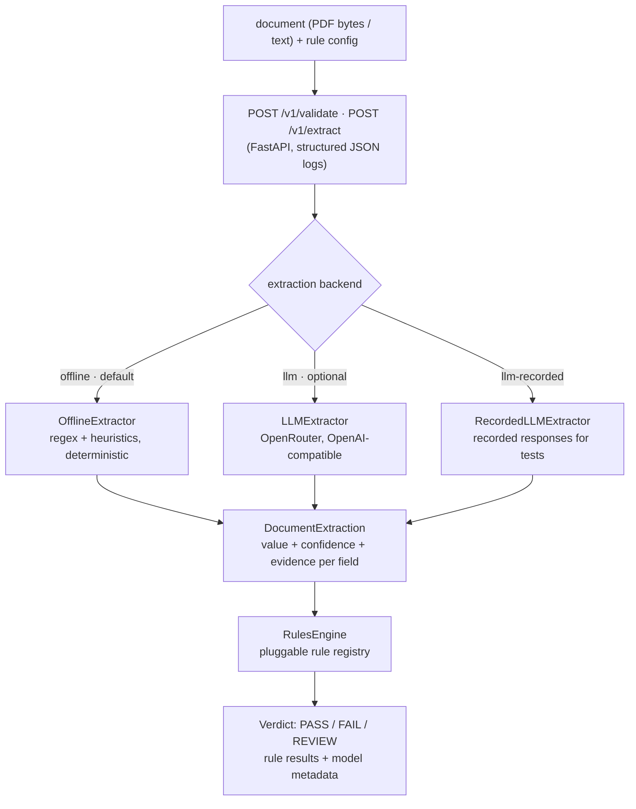

# docvalidator — AI document validator (production-shaped slice)

Structured field extraction + configurable business-rule verdicts for `SUPPLIER_INVOICE`
documents, exposed as a thin FastAPI service, with an offline-first extraction design
and a measurable evaluation harness.

> Status: work in progress (24h technical assessment). This README is completed in the final phase.

## Quickstart (60 seconds)

```bash
uv sync
uv run uvicorn docvalidator.api.main:app --reload --port 8000
# health check
curl -s localhost:8000/health
```

No API keys required — the default extraction backend is a deterministic offline extractor.

## Golden dataset v2

The fixed evaluation set is generated, not hand-maintained. It contains 60
documents: 40 text cases and 20 single-page PDF cases, split evenly between
English and Spanish. Tier 0 is canonical, tier 1 adds label and format variants,
and tier 2 stresses rare labels, mixed formats, and unlabeled/mixed currency.
Every case carries generated field truth and verdict truth.

| Lane | Tier | Count | Scenarios |
|---|---:|---:|---|
| TXT | 0 | 12 | clean, stale |
| TXT | 1 | 16 | clean, stale variants |
| TXT | 2 | 12 | missing total, mixed/unlabeled currency |
| PDF | 0 | 6 | clean, stale |
| PDF | 1 | 8 | clean, missing date |
| PDF | 2 | 6 | clean, mixed/unlabeled currency |

Regenerate or verify it with:

```bash
uv run python -m fixtures.generator.build
uv run python -m fixtures.generator.build --verify
```

The build writes `manifest_txt.json` and `manifest_pdf.json` fragments plus the
merged `manifest.json`; `--verify` re-derives both lanes and checks hashes and
orphan files. There is no tier 3 lane: rule scenarios are distributed in tiers
0–2 and remain represented by their expected verdicts.

### Gates policy

`eval.run` prints a `GATES` section by default:

- `tier:0` is hard for each lane: field accuracy and verdict agreement >= `0.95`.
- `tier:1` is hard for each lane: field accuracy >= `0.60` and verdict agreement >= `0.25`.
- `tier:2` and scenario slices are informative.
- Lane and global lane aggregates are informative; `--no-gates` preserves the
  legacy optional `--min-field-accuracy` and `--min-verdict-agreement` behavior.

### Extractor offline baseline

Measured 2026-09-03 with `uv run python -m eval.run --as-of 2026-09-03`:

| Slice | Field accuracy | Verdict agreement |
|---|---:|---:|
| TXT tier 0 | 100.00% | 100.00% |
| TXT tier 1 | 68.75% | 31.25% |
| TXT tier 2 | 41.67% | 33.33% |
| PDF lane overall | 80.83% | 60.00% |

## Evaluation harness

```bash
uv run python -m eval.run --as-of 2026-09-03   # both lanes over the v2 golden set, GATES section
# hard gates by tier: tier0 >= 0.95/0.95, tier1 >= 0.60/0.25; tier2 and scenario slices informative
uv run python -m eval.run --no-gates           # report only
```

Two lanes run over the v2 golden set (40 txt + 20 single-page pdf fixtures across
tiers 0-2: label/format variants, unlabeled currency, distractor totals, textured
PDF layouts): the deterministic offline extractor (LLM and recorded-LLM
backends plug into the same interface), so the comparison is reproducible
without credentials. Runs are anchored to
`--as-of` (default 2026-09-03) so age-rule expectations never rot with
wall-clock time. Known extractor misses at tier 1-2 (see the measured table
above): spelled-out dates, GB-format VAT ids, and rare label variants — the
dataset isolates them; closing the gap is the LLM backend's job.

## API

| Method | Path | Purpose |
|---|---|---|
| POST | `/v1/validate` | document + config → extraction + rule verdict |
| POST | `/v1/extract` | document → extraction only |
| GET  | `/health` | liveness |

### API contract

`POST /v1/validate` accepts **either** representation:

- **Multipart form** (`multipart/form-data`): `file` (a `.pdf` — read through its text layer —
  or a `.txt`) + `config` (a JSON string matching the config example above).
- **JSON body** (`application/json`), exactly one content source:
  - `text` — plain-text document content, **or**
  - `content_b64` — base64-encoded document bytes (PDF by default; decoded as text when
    `filename` ends in `.txt`) — plus optional `filename`;
  - optional `config` (defaults apply when omitted);
  - optional `extraction_backend`: `offline` (default) | `llm` | `llm-recorded`.

Responses: `200` with the verdict (see the sample below), `422` with a structured
`{"error": {"code", "message", "details"}, "request_id"}` body for invalid input or
unreadable documents, `5xx` only for upstream LLM failures. Every response echoes an
`X-Request-ID` header (client-supplied or generated) that also appears in the structured logs.

`POST /v1/extract` accepts the same representations and returns only the extraction object.

## Architecture



Key decisions (full rationale below in Trade-offs):

1. **Offline-first.** The deterministic extractor is the default backend; reviewers can run
   everything without paid credentials. The LLM path is an interchangeable adapter, not a dependency.
2. **REVIEW vs FAIL distinction.** Missing required data ⇒ `REVIEW` (cannot judge); a violated
   rule with data present ⇒ `FAIL` (judged and rejected). Compliance verdicts need this nuance.
3. **Confidence is evidence-strength, not model probability.** Documented per-field: labeled
   pattern > structural pattern > heuristic.

### LLM extraction system prompt

The offline heuristics were specified in [`docs/prompts/`](docs/prompts/) (the executor briefs).
The LLM backend's system prompt — the single source of truth lives in
`src/docvalidator/extraction/llm.py` — is:

```text
You extract supplier invoice fields. Return ONLY strict JSON with keys
"supplier_name", "invoice_number", "invoice_date", "total_amount", "currency", "tax_id".
Use null for absent fields, ISO dates (YYYY-MM-DD), float amounts, and ISO-4217 currency codes.
Example: {"supplier_name":"ACME Ltd","invoice_number":"INV-1","invoice_date":"2026-01-31",
"total_amount":123.45,"currency":"EUR","tax_id":"DE123456789"}
```

The response is parsed into the canonical Pydantic model with typed coercion
(`date.fromisoformat`, `float`); anything else raises a typed `LLMParsingError` instead of
silently producing a wrong verdict.

## Verdict contract

`PASS` — all rules evaluated and passed · `FAIL` — at least one rule failed with data present ·
`REVIEW` — required data missing, human should look at the document.

<!-- Sample request/response: filled in the final phase -->

### Sample request/response

```bash
curl -s -X POST localhost:8000/v1/validate \
  -H 'Content-Type: application/json' \
  -d '{
    "text": "ACME Supply GmbH\nInvoice No: INV-2026-041\nInvoice Date: 2026-09-01\nTotal: 1250.00\nCurrency: EUR\nVAT: DE123456789",
    "config": {
      "max_age_days": 90,
      "allowed_currencies": ["EUR", "GBP"],
      "required_fields": ["supplier_name", "invoice_number", "invoice_date", "total_amount"]
    }
  }'
```

```json
{
  "status": "PASS",
  "rule_results": [
    {"rule_id": "invoice_date_present_and_fresh", "passed": true, "message": "invoice date is present and fresh", "inconclusive": false},
    {"rule_id": "total_amount_present_and_positive", "passed": true, "message": "total amount is present and positive", "inconclusive": false},
    {"rule_id": "supplier_name_present", "passed": true, "message": "supplier name is present", "inconclusive": false},
    {"rule_id": "currency_allowed", "passed": true, "message": "currency is allowed", "inconclusive": false}
  ],
  "extraction": {
    "document_type": "SUPPLIER_INVOICE",
    "fields": {
      "supplier_name":  {"value": "ACME Supply GmbH", "confidence": 0.8,  "evidence": "ACME Supply GmbH",   "page_hint": null},
      "invoice_number": {"value": "INV-2026-041",     "confidence": 0.95, "evidence": "Invoice No: INV-2026-041", "page_hint": null},
      "invoice_date":   {"value": "2026-09-01",       "confidence": 0.95, "evidence": "2026-09-01",       "page_hint": null},
      "total_amount":   {"value": 1250.0,             "confidence": 0.95, "evidence": "Total: 1250.00",   "page_hint": null},
      "currency":       {"value": "EUR",              "confidence": 0.95, "evidence": "Currency: EUR",    "page_hint": null},
      "tax_id":         {"value": "DE123456789",      "confidence": 0.95, "evidence": "VAT: DE123456789", "page_hint": null}
    },
    "metadata": {"backend": "offline", "duration_ms": 1.711, "model": null, "provider": null, "total_tokens": null}
  },
  "request_id": "a5cb8bb2-8f10-4b02-aa77-be3b8e07d49e"
}
```

Errors are structured too: `{"error": {"code": "...", "message": "...", "details": [...]}, "request_id": "..."}`.


## Trade-offs consciously made

1. **Offline-first over LLM-first.** The deterministic extractor is the default backend. Rationale:
   reviewers run everything without credentials, behavior is 100% testable and replayable, per-document
   latency is single-digit milliseconds, and cost is zero. The LLM path exists as a swappable adapter
   for layouts the heuristics can't handle. The eval harness makes the quality of either path measurable.
2. **REVIEW ≠ FAIL.** A rule whose input data is missing is marked `inconclusive` and cannot push the
   verdict to `FAIL`; missing required fields surface as `REVIEW`. Rationale: in compliance workflows,
   "judged and rejected" (FAIL) and "cannot judge, human needed" (REVIEW) have very different operational
   consequences — FAIL may block a supplier, REVIEW queues work. Conflating them would misroute documents.
3. **Confidence = evidence strength, not model probability.** Offline confidences encode pattern quality
   (labeled 0.95 / structural 0.7–0.9 / heuristic <0.5); the LLM path reports a fixed 0.75 because
   model-reported confidence is not calibrated. We prefer an honest constant to a fake decimal.
4. **Fixtures instead of real OCR.** The scope note says OCR is out of scope; PDFs are supported through
   the text layer (pypdf) and plain-text fixtures drive the golden set. Scanned-image PDFs fail loudly
   with a typed error instead of silently returning empty extractions.
5. **One document type, extensible seams.** Only `SUPPLIER_INVOICE` is implemented, but the extractor
   interface, rule registry, and config schema are document-type aware; adding `CERTIFICATE` means a new
   extractor + rules, not a rewrite.

## Cost, latency, and risk notes

**When would you *not* use an LLM here?**

- Digital-born PDFs with stable labeled layouts (typical B2B invoice PDFs): regex/structural extraction
  is deterministic, free, ~ms-fast, and unit-testable — an LLM adds cost, latency, nondeterminism, and a
  failure mode without a quality win.
- Any verdict path that must be explainable in an audit: regex evidence (the exact matched text) is
  stronger evidence than an LLM's answer.
- Very high volume of low-value documents where a wrong extraction just routes to review anyway.

The LLM earns its keep on messy OCR text, highly varied layouts, and multi-language suppliers — that's
why it ships as an opt-in adapter with a recorded stub for offline testing.

**What did we measure?**

- Offline path (measured, from the structured request logs): **~3.5 ms** end-to-end per document
  (extraction + rules), zero marginal cost.
- LLM path (measured live, model `z-ai/glm-5.3-flash` via OpenRouter, single invoice): **~7.5 s,
  ~300 total tokens** per document → well under a cent per document on an open-weight model.
  Per-document latency and token usage are returned in `extraction.metadata` (`duration_ms`,
  `model`, `provider`, `total_tokens`) and logged per request.
- Eval harness: two lanes over a 20-fixture golden set — offline **0.99 field accuracy / 1.00 verdict
  agreement** (the one miss is the documented US-date ambiguity), recorded-LLM **1.00 / 1.00** — with
  `--min-*` thresholds that fail CI on regression.

**What would we monitor in production?**

- **Quality drift:** scheduled re-run of the golden set + a sample of live documents against updated
  expectations; alert on field accuracy or verdict agreement dropping below threshold.
- **Confidence distribution:** a shift toward low-confidence extractions signals layout drift before
  customers complain.
- **Verdict mix:** sudden changes in PASS/FAIL/REVIEW ratios usually mean upstream document format
  changes (or extractor regressions).
- **Cost & latency (LLM backend):** tokens and ms per document per day, provider error/timeout rates,
  spend cap alerts.
- **Operational:** request error rate by code (422 vs 5xx), PDF text-layer failures (they indicate
  scanned documents needing real OCR).

## What I would do next with another day

Done since the first submission: golden set grown 6 → 20 adversarial fixtures (subtotal traps,
credit notes, US/JP formats, OCR noise, empty documents), offline-vs-recorded-LLM comparison lane,
and the eval wired into CI as a regression gate with `--min-*` thresholds.

1. Locale-metadata-aware date disambiguation (the known `us_date_ambiguous` miss) instead of
   always reading `03/07/2026` day-first.
2. Real OCR adapter (Azure Document Intelligence) behind the same `Extractor` interface for scanned PDFs.
3. Page-level evidence spans and a debug endpoint returning per-field extractor traces.
4. Second document type (`CERTIFICATE_OF_INCORPORATION`) to pressure-test the extensibility claim.
5. Optional live LLM lane in the eval harness (real API, gated behind a key) next to the recorded one.
